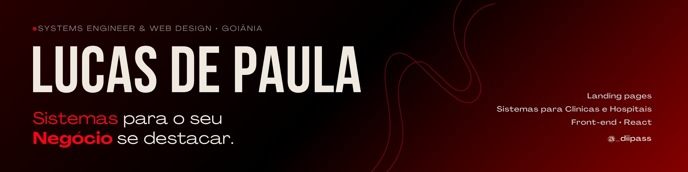

# Opa, Eu sou o Lucas 🙋‍♂️

**Desenvolvedor de Software | Backend, APIs e Integrações | AI Worker | Cursando Sistemas de Informação**

Construo e evoluo soluções digitais para problemas reais, de formulários e painéis a fluxos com pagamentos, documentos e APIs. Uso ferramentas de IA como apoio no desenvolvimento e participo da definição dos requisitos, dos testes e dos ajustes necessários para cada operação.

Estou aberto a oportunidades em **desenvolvimento de software e TI**.

- 🎨 **Front-end:** HTML, CSS, JavaScript, React e TypeScript em formulários, landing pages e interfaces responsivas.
- ⚙️ **Back-end e dados:** PHP, Laravel, Node.js no QuantaCorp, MySQL/MariaDB e SQL.
- 🔗 **APIs e automações:** integrações com Asaas (PIX), Autentique e ViaCEP; webhooks, APIs REST/GraphQL e geração de PDFs.
- 🧩 **Experiência prática:** sistemas de pré-internação, gestão de contratos, dashboards administrativos e simuladores.
- 🖥️ **Hardware e suporte técnico:** montagem e desmontagem de computadores, manutenção preventiva, limpeza e testes de componentes para identificar falhas, formatação de computadores otimização de sistema operacional.
- 🌱 **Infraestrutura e servidores (em aprendizado):** conhecimentos iniciais de Linux e SSH; estudo de configuração de ambientes e publicação de aplicações web para projetos futuros.

## Projetos em destaque

<table>
  <tr>
    <td width="50%" valign="top">
       
      <b>Cirurgia Blindada</b> 
      Contratos, pagamentos PIX, assinaturas e gestão operacional. 
      PHP · MySQL · JavaScript · APIs 
      <a href="https://cirurgiablindada.com/">Acessar site</a> · <a href="https://github.com/Diipass/portfolio/blob/main/projects/cirurgia-blindada.md">Ver projeto</a>
    </td>
    <td width="50%" valign="top">
       
      <b>Fêmina Internação</b> 
      Pré-internação hospitalar, documentos e painel da equipe. 
      PHP · MySQL/MariaDB · JavaScript 
      Em testes; captura pública com dados não preenchidos.
    </td>
  </tr>
  <tr>
    <td width="50%" valign="top">
       
      <b>Dashboard de Tráfego</b> 
      Clientes, contas de anúncios e relatórios de marketing. 
      Laravel · PHP · integrações 
      Sem demonstração pública para o portfólio.
    </td>
    <td width="50%" valign="top">
       
      <b>Cicatrix</b> 
      Landing e formulário para protocolos de cuidado de cicatrizes. 
      HTML · CSS · JavaScript 
      Prévia visual; site ainda não publicado.
    </td>
  </tr>
  <tr>
    <td width="50%" valign="top">
       
      <b>Quanta Corp</b> 
      Simulador de receita para parceiros em versão demonstrativa. 
      HTML · CSS · JavaScript · Node.js 
      Publicação em preparação.
    </td>
    <td width="50%" valign="top">
       
      <b>Brasa e Fogão</b> 
      Biosite para apresentar o restaurante e seus canais. 
      React · TypeScript · TanStack Start 
      Tailwind CSS · Vite 
      Biosite local, ainda sem link público.
    </td>
  </tr>
</table>

O [portfólio](https://github.com/Diipass/portfolio) explica o contexto e minha participação em cada projeto. Os repositórios dos sistemas e os dados de clientes permanecem privados.

## Experiência prática

- **Web e sistemas:** PHP, HTML, CSS, JavaScript, Laravel e interfaces responsivas em projetos diferentes.
- **Node.js:** servidor e lógica do simulador Quanta Corp; também usado em ferramentas de desenvolvimento em outros projetos.
- **Dados e integrações:** MySQL/MariaDB, SQL, APIs REST e GraphQL, webhooks e automação de documentos.
- **Operação:** diagnóstico de falhas, ajustes a partir do uso real, publicação e manutenção de aplicações.
- **Em evolução:** fluxo de trabalho com Git e GitHub.

## Contato

[llucasdpcf@gmail.com](mailto:llucasdpcf@gmail.com)
